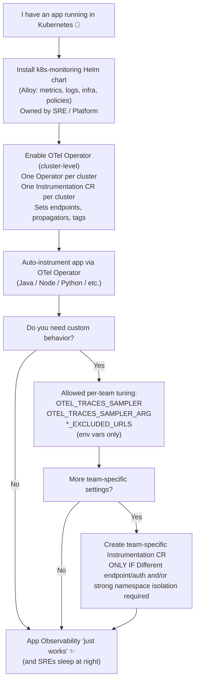

# Grafana Cloud Application Observability - Recommended Path

Welcome to the lab! A frequent feedback we get from customers is that Application Observability has no easy button and it's not clear how to do it in an easy, opinionated fashion.  The goal here is to provide that, which should work for the majority of customers out of the box

We'll be deploying some demo apps with no prior instrumentation, the k8s-monitoring helm chart, the otel operator, and instrumenting these applications to enable the full App O11y experience!

Currently this is driven primarily by a google doc guide [App O11y Recommended Path](https://docs.google.com/document/d/17H9SVaQ9q_8MCykqotYHxrrEqCGTGjE7ccXmYLeBaBY/) which will eventually land in the public docs after some further review.  This lab assumes you have already read this doc, so if not go do this first!

## Definitions

### Prometheus

The primary metrics ecosystem in use with Grafana Cloud and Application Observability.  OpenTelemetry metrics are currently often converted to prometheus-style metrics for use in our Kubernetes and Application Observability apps

### OpenTelemetry

A collection of tools, APIs, and SDKs, OpenTelemetry helps engineers instrument, generate, collect, and export telemetry data such as metrics, logs, and traces, in order to analyze software performance and behavior.

More details [here](https://grafana.com/oss/opentelemetry/)

### What is Pyroscope/Profiles?

[Grafana Pyroscope](https://grafana.com/oss/pyroscope/) is an open source continuous profiling database that provides fast, scalable, highly available, and efficient storage and querying. This helps you get a better understanding of resource usage in your applications down to the line number.

Profiles are the output from Pyroscope and considered the new 4th pillar of observability.  Profiles offer a view of where and how resources are used, down to the code level. In profiling, data is captured periodically, creating snapshots of application behavior that can help identify performance bottlenecks, inefficient code, or unexpected resource consumption. Pyroscope supports integration with OpenTelemetry, so profiles can be correlated with traces and metrics for comprehensive observability, making it valuable for performance tuning and resource optimization.

### Grafana Cloud Application Observability

[Application Observability](https://grafana.com/docs/grafana-cloud/monitor-applications/application-observability/) or as it is often referred to as `app o11y`, is an application performance monitoring (APM) solution designed to empower your team to minimize the mean time to repair (MTTR) for application problems. The Application Observability ecosystem consists of:

- Open source OpenTelemetry SDKs to instrument your applications
- Grafana Alloy, an OpenTelemetry Collector, to enhance and scale your data pipeline
- Ready-made dashboards and tools in Grafana Cloud to observe and monitor your services

## Flowchart Diagram

## Start here

First up, [prerequisites](docs/00-prereqs.md) for this lab
