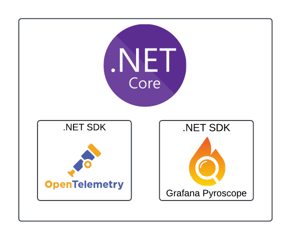
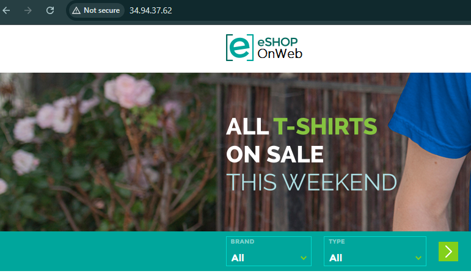
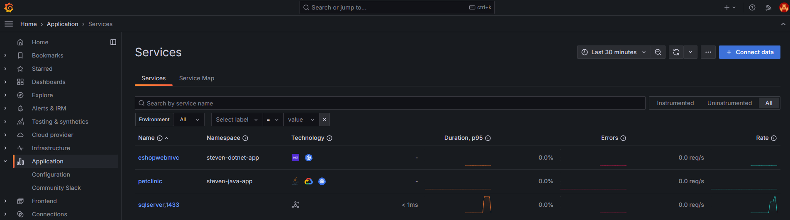

# Instrumenting Java and .NET apps for Grafana Cloud Application Observability

## Participant guide - Instrumenting a .NET app

This guide is for the participants of the lab on instrumenting a .NET app.  Please ensure [prerequisites](1-provider-guide.md) are completed first, along with the [k8s-monitoring deployment](participant-guide-k8s-monitoring.md) complete.  If at any point you run into problems, check the [troubleshooting section](troubleshooting.md) for areas to look at or notify your lab provider.

We'll be using a .NET Core app called [eShopOnWeb](https://github.com/dotnet-architecture/eShopOnWeb) that has been pre-built into 2 separate docker images, one for the [api](https://hub.docker.com/r/stevenshaw212/eshoppublicapi) and one for the [webapp](https://hub.docker.com/r/stevenshaw212/eshopwebmvc).  The webapp container has already had the code changes made to it due to time constraints, we'll cover those later on.  Metrics/traces/logs will be sent via the Grafana OpenTelemetry distribution for .NET which will forward to the OTEL receivers in our Alloy pods via the k8s-monitoring helm chart we deployed previously.  Profiles will be collected via the the Grafana Pyroscope .NET Profiler.



### Grafana OpenTelemetry distribution for .NET SDK for metrics/logs/traces via OTEL

Modify the [dotnet-configmap.yaml](../participant/dotnet-configmap.yaml) file as follows

1. Update `OTEL_EXPORTER_OTLP_ENDPOINT` with your name `"http://<yourname>-k8s-monitoring-alloy.<yourname>-k8smonitoring.svc.cluster.local:4137"`
1. Update `OTEL_RESOURCE_ATTRIBUTES` with your name `"deployment.environment=dev,service.namespace=<yourname>-dotnet-app,service.version=1.0.0"`

### Grafana Pyroscope .NET SDK Profiler for profiles

Modify the [dotnet-configmap.yaml](../participant/dotnet-configmap.yaml) file as follows

1. Update `PYROSCOPE_SERVER_ADDRESS`, `PYROSCOPE_BASIC_AUTH_USER`, and `PYROSCOPE_BASIC_AUTH_PASSWORD` with the details from your Pyroscope instance in your Grafana Cloud Stack
1. Update `PYROSCOPE_LABELS` with your name `"namespace:<yourname>-dotnet-app,environment:dev"`

### Deploy the app

Now create your namespace and deploy the app

``` shell
kubectl create namespace <yourname>-dotnet-app
kubectl apply -f "dotnet-*.yaml" -n <yourname>-dotnet-app
```

Check logs on the eshopwebmvc pod via `k9s` to ensure app starts up with instrumentation libraries loaded.  Then grab the loadbalancer IP to access your app and generate some traffic, if it returns empty try again in a minute

``` shell
kubectl get svc eshop -n <yourname>-dotnet-app -o jsonpath='{.status.loadBalancer.ingress[0].ip}' && echo ""
```

After about 5 minutes after generating some traffic, you should see the metrics/logs/traces/profiles in your Grafana Cloud Application Observability app located under the Application menu item in your hosted Grafana instance!





### Bonus round - adding a synthetic monitoring check to generate some traffic for you

Instead of having to click around to generate some traffic to see on your application signal graphs in app o11y, let's have Synthetic Monitoring do that for you so it looks more like an app in use!

1. In your hosted Grafana instance, navigate to Testing & synthetics -> Synthetics -> Checks and click on New check then API Endpoint check
1. Enter any job name, and add the following requests - 3 in total - using the IP of your app above
    1. `http://<ip>`
    1. `http://<ip>/Basket`
    1. `http://<ip>/error`
1. Skip ahead to the Execution section, select SanFrancisco for the Probe location and adjust the Frequency to 1 minute
1. Hit save, and watch your app o11y traffic get steady metrics and traces

### So what did we just do

Diagrams for the flows of traffic and instrumentation methods used, OTLP gateway vs Alloy, why did we use k8s-monitoring, etc

Code changes

.NET instrumentation levels, auto vs semi-auto vs manual

Core vs framework

Profiles diagrams bowing we don't yet have an alloy receiver, so these go straight to cloud for now

## Next up

Nothing! You made it to the end of this lab, congrats!


