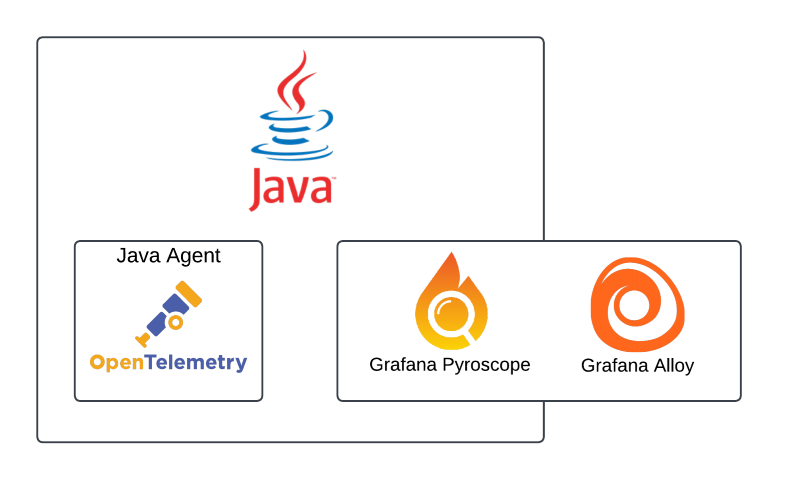
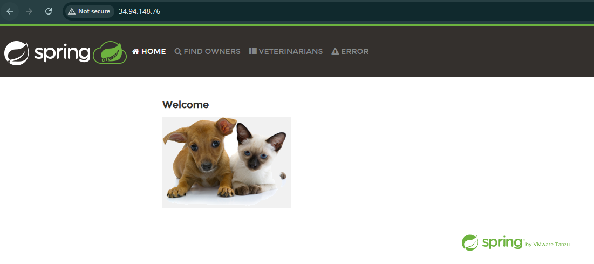
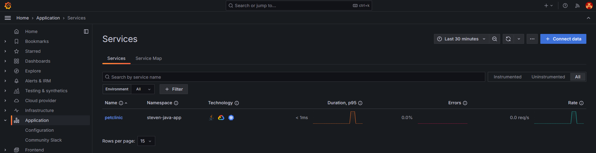
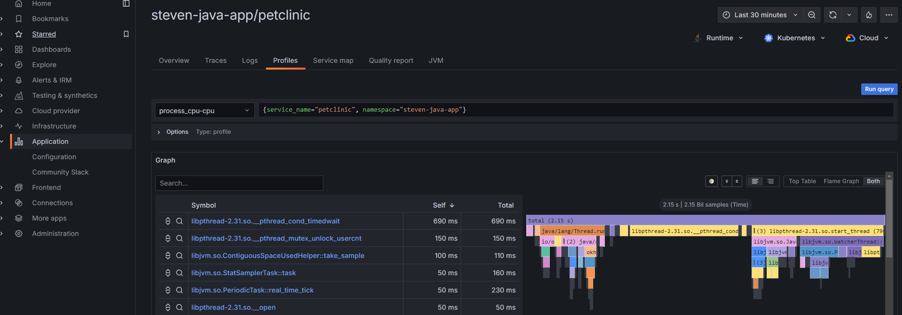

# Instrumenting Java and .NET apps for Grafana Cloud Application Observability

## Participant guide - Instrumenting a Java app

This guide is for the participants of the lab on instrumenting a java app.  Please ensure [prerequisites](1-provider-guide.md) are completed first, along with the [k8s-monitoring deployment](participant-guide-k8s-monitoring.md) complete.  If at any point you run into problems, check the [troubleshooting section](troubleshooting.md) for areas to look at or notify your lab provider.

We'll be using a spring java app called [petclinic](https://github.com/spring-projects/spring-petclinic) that has been pre-built into a docker image located [here](https://hub.docker.com/r/stevenshaw212/spring-petclinic) with no instrumentation added.  Metrics/traces/logs will be sent via the Grafana OpenTelemetry java agent which will forward to the OTEL receivers in our Alloy pods via the k8s-monitoring helm chart we deployed previously.  Profiles will be collected via the the Grafana Alloy `pyroscope.java` component.



### Grafana OpenTelemetry java agent for metrics/logs/traces via OTEL

Modify the [java-otel-configmap.yaml](../participant/java-otel-configmap.yaml) file as follows

1. Update `OTEL_EXPORTER_OTLP_ENDPOINT` with your name `"http://<yourname>-k8s-monitoring-alloy.<yourname>-k8smonitoring.svc.cluster.local:4137"`
1. Update `OTEL_RESOURCE_ATTRIBUTES` with your name `"deployment.environment=dev,service.namespace=<yourname>-java-app,service.version=1.0.0"`

Now create your namespace and deploy the app

``` shell
kubectl create namespace <yourname>-java-app
kubectl apply -f "java-*.yaml" -n <yourname>-java-app
```

Check logs on the petclinic pod via `k9s` to ensure app starts up with instrumentation libraries loaded.  Then grab the loadbalancer IP to access your app and generate some traffic, if it returns empty try again in a minute

``` shell
kubectl get svc petclinic -n <yourname>-java-app -o jsonpath='{.status.loadBalancer.ingress[0].ip}' && echo ""
```

After about 5 minutes after generating some traffic, you should see the metrics/logs/traces/profiles in your Grafana Cloud Application Observability app located under the Application menu item in your hosted Grafana instance!  If you want to generate some logs, click on the Error tab in the top-right of the petclinic web app.





### What about profiles?

Well there's actually nothing to do here, as we're already collecting any java processes in your namespace, adding some relabeling to match what app o11y is looking for, and feeding them to Alloy's pyroscope.java component!



### Bonus round - adding a synthetic monitoring check to generate some traffic for you

Instead of having to click around to generate some traffic to see on your application signal graphs in app o11y, let's have Synthetic Monitoring do that for you so it looks more like an app in use!

1. In your hosted Grafana instance, navigate to Testing & synthetics -> Synthetics -> Checks and click on New check then API Endpoint check
1. Enter any job name, and add the following requests - 3 in total - using the IP of your app above
    1. `http://<ip>`
    1. `http://<ip>/vets.html`
    1. `http://<ip>/oups`
1. Skip ahead to the Execution section, select SanFrancisco for the Probe location and adjust the Frequency to 1 minute
1. Hit save, and watch your app o11y traffic get steady metrics and traces

### So what did we just do

Diagrams for the flows of traffic and instrumentation methods used, OTLP gateway vs Alloy, why did we use k8s-monitoring, etc

More details on things like resource providers

## Next up

Time permitting, move on to the [.NET instrumentation](./participant-guide-dotnet.md)
