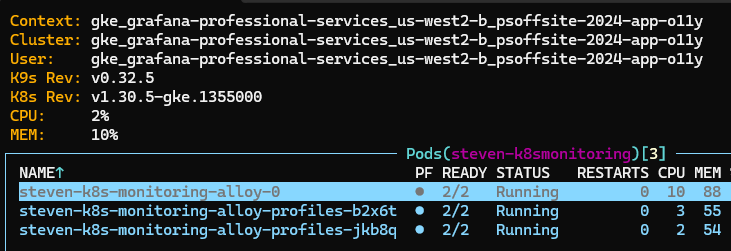

# Instrumenting Java and .NET apps for Grafana Cloud Application Observability

## Participant guide - Deploying k8s-monitoring

K8s-monitoring is how we most often deploy Alloy on K8s clusters, and this lab relies on it as a standard way to deploy Alloy with OTEL receivers to then forward metrics/logs/traces to your Grafana Cloud Stack.  This is not the only way, but is a standard approach given most customers will either already have k8s-monitoring or will be deploying it.

### Clone this repo

Like all good labs in a GitHub repo, first you need to clone it down to work with it!

```shell
git clone https://github.com/grafana-ps/lab-app-o11y \
    && cd lab-app-o11y/participant
```

### Access to a K8s cluster

The provider of the lab should have provisioned a K8s cluster for you to use, however the following will work on any K8s cluster available that has external IP load balancing integration available.

To access the K8s cluster provided for this lab, run the following command

``` shell
gcloud container clusters get-credentials psoffsite-2024-app-o11y --region us-west2-b --project grafana-professional-services
```

### Deploy k8s-monitoring with OTEL receivers and profiling for java via alloy

Here we will deploy the k8s-monitoring helm chart to your own namespace, which in turn deploys Grafana Alloy with OTEL receivers and the pyroscope.java component.  These are used later on by the app we'll instrument to send metrics/traces/logs/profiles to your Grafana Cloud Stack.

Modify the [example values file](../participant/k8s-monitoring-participant-values.yaml) as follows

1. Update `cluster.name` with `<yourname>-psoffsite-app-o11y`
1. Update `externalServices` with your prometheus, loki, tempo and pyroscope endpoints found in your Grafana Cloud Stack details.  Use the token from the access policy created in the [prerequisites](1-provider-guide.md) as the password
1. Update `profiles.java.namespaces` to `<yourname>-java-app`

Commands to run the deployment as follows, ensure to update where it says `<yourname>` to your actual name.  This is to ensure we don't conflict with other lab participants

``` shell
helm repo add grafana https://grafana.github.io/helm-charts
helm repo update
helm upgrade --install --atomic --timeout 300s <yourname>-k8s-monitoring grafana/k8s-monitoring --namespace "<yourname>-k8smonitoring" --create-namespace --values k8s-monitoring-participant-values.yaml
```

Use `k9s` to ensure services are deployed and running properly.



## Next up

Move on to [instrumenting a java app](./participant-guide-java.md)
